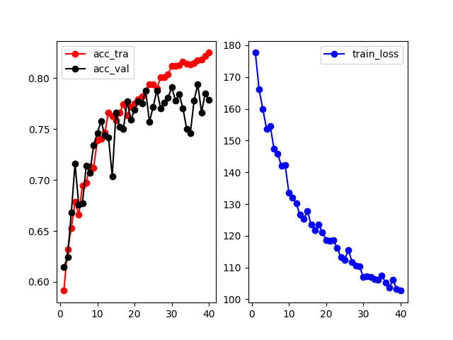

# 一些补充

**此仓库介绍：不使用VGG16预训练权重、按照VGG16的结构定义net，去训练猫狗二分类任务**

*原谅我没有上传训练的权重结果，麻烦大家去自己训练了*

---
参考的网络结构图如下


---
加入BN, dropout=0.5, weight_decay=0.01, epochs=40 训练可视化结果


---
## 使用的环境包

主要是

pytorch--2.0.1--py3.8_cuda11.8_cudnn8_0 

matplotlib--3.5.1

除此之外没有什么特别的包  

&nbsp;&nbsp;&nbsp;*提供了一个my_env.yaml* 
```bash
conda env create -f my_env.yml
```
**注意：我本地的环境名字就叫“E:/my_env”**

&nbsp;&nbsp;&nbsp;&nbsp;&nbsp;&nbsp;&nbsp;&nbsp;可以运行一下 test_your_GPU.py看看GPU是否可用
```bash
python test_your_GPU.py
```
---
## 数据集

raw_data文件夹里两个子目录,cat中5000张图片,dog中4000中图片

---
## 运行说明
步骤：
1. 第一步 txt.py 
2. 第二步 train.py 
3. 第三步 test.py

---
### 在train.py中

- 1、定义了优化器与学习率

- 2、可修改训练轮数epochs

- 3、要保存训练结束的网络权重，记得解开以下注释
```python
# ## 最后保存一下模型
# torch.save(net,"./model/{}.pth".format(epoch+1))
# print("模型已保存")
```

- 4、绘制 loss曲线、准确率曲线
---
### 在net.py中

- 1、从上到下依次定义了4个NET类：net_BN、net_LN、net_GN、没有normalization的net

使用的是net_BN（添加了BatchNorm）,其他均被注释掉了。

- 2、因为是2分类，所以要让最后一层的Linear_out_features = 2 ，在prepare_train.py中添加了一层
```python
net.classifier.add_module("my", nn.Linear(1000, 2))
```
&nbsp;&nbsp;&nbsp;&nbsp;&nbsp;&nbsp;&nbsp;&nbsp;&nbsp;&nbsp;&nbsp;*net_BN的结构输出写在最后附录，最后的 my 层1000->2*

---
### 在prepare_train.py中

- 1、写了dataset、dataloader、device、loss_function等一些其他训练准备工作的内容

- 2、这里注释掉了加载预训练权重VGG16_Weights (vgg16-397923af.pth) 的行，
如使用的话，解开下面这段的注释
```python
# ## 如果想要使用vgg16的预训练权重,解开下面紧接着的这行的注释
# net.load_state_dict(torch.load(r"vgg16-397923af.pth"))
```
并且在net.py中去使用下面的这个NET类
```python
# # 早期没有normalization的net
# class NET(nn.Module):
#     def __init__(self):
#         nn.Module.__init__(self)
#         self.features = nn.Sequential(
#             nn.Conv2d(in_channels=3, out_channels=64, padding=1, kernel_size=3),
。。。
#         )
#
#     def forward(self, x):
#         x = self.features(x)
#         x = flatten(x, 1)
#         x = self.classifier(x)
#         return x
```
*vgg16-397923af.pth是用 没有添加BN的VGG16 训练得到的，权重下载地址：https://download.pytorch.org/models/vgg16-397923af.pth*


*PS：在https://pytorch.org/vision/stable/_modules/torchvision/models/vgg.html#VGG16_Weights 可以找到 **VGG16_BN_Weights**，这样就可以继续使用net.py里的net_BN，但我没有试过下载并加载它*

---
### 在test.py中

- 1、可以打开当前目录的图片
```python
  image_path=r"test1.png" #指定路径也可
```
*提供了test1.png、test2.png*

- 2、加载训练完的网络
```python
model=torch.load(r" ")    # 在" "写训练完保存的网络权重地址,
                          # train.py保存的格式是torch.save(net,"./model/{}.pth".format(epoch+1))
```


---
## 附录:
net_BN结构：
```bash
NET(
  (features): Sequential(
    (0): Conv2d(3, 64, kernel_size=(3, 3), stride=(1, 1), padding=(1, 1))
    (1): BatchNorm2d(64, eps=1e-05, momentum=0.1, affine=True, track_running_stats=True)
    (2): ReLU()
    (3): Conv2d(64, 64, kernel_size=(3, 3), stride=(1, 1), padding=(1, 1))
    (4): BatchNorm2d(64, eps=1e-05, momentum=0.1, affine=True, track_running_stats=True)
    (5): ReLU()
    (6): MaxPool2d(kernel_size=2, stride=2, padding=0, dilation=1, ceil_mode=False)
    (7): Conv2d(64, 128, kernel_size=(3, 3), stride=(1, 1), padding=(1, 1))
    (8): BatchNorm2d(128, eps=1e-05, momentum=0.1, affine=True, track_running_stats=True)
    (9): ReLU()
    (10): Conv2d(128, 128, kernel_size=(3, 3), stride=(1, 1), padding=(1, 1))
    (11): BatchNorm2d(128, eps=1e-05, momentum=0.1, affine=True, track_running_stats=True)
    (12): ReLU()
    (13): MaxPool2d(kernel_size=2, stride=2, padding=0, dilation=1, ceil_mode=False)
    (14): Conv2d(128, 256, kernel_size=(3, 3), stride=(1, 1), padding=(1, 1))
    (15): BatchNorm2d(256, eps=1e-05, momentum=0.1, affine=True, track_running_stats=True)
    (16): ReLU()
    (17): Conv2d(256, 256, kernel_size=(3, 3), stride=(1, 1), padding=(1, 1))
    (18): BatchNorm2d(256, eps=1e-05, momentum=0.1, affine=True, track_running_stats=True)
    (19): ReLU()
    (20): Conv2d(256, 256, kernel_size=(3, 3), stride=(1, 1), padding=(1, 1))
    (21): BatchNorm2d(256, eps=1e-05, momentum=0.1, affine=True, track_running_stats=True)
    (22): ReLU()
    (23): MaxPool2d(kernel_size=2, stride=2, padding=0, dilation=1, ceil_mode=False)
    (24): Conv2d(256, 512, kernel_size=(3, 3), stride=(1, 1), padding=(1, 1))
    (25): BatchNorm2d(512, eps=1e-05, momentum=0.1, affine=True, track_running_stats=True)
    (26): ReLU()
    (27): Conv2d(512, 512, kernel_size=(3, 3), stride=(1, 1), padding=(1, 1))
    (28): BatchNorm2d(512, eps=1e-05, momentum=0.1, affine=True, track_running_stats=True)
    (29): ReLU()
    (30): Conv2d(512, 512, kernel_size=(3, 3), stride=(1, 1), padding=(1, 1))
    (31): BatchNorm2d(512, eps=1e-05, momentum=0.1, affine=True, track_running_stats=True)
    (32): ReLU()
    (33): MaxPool2d(kernel_size=2, stride=2, padding=0, dilation=1, ceil_mode=False)
    (34): Conv2d(512, 512, kernel_size=(3, 3), stride=(1, 1), padding=(1, 1))
    (35): BatchNorm2d(512, eps=1e-05, momentum=0.1, affine=True, track_running_stats=True)
    (36): ReLU()
    (37): Conv2d(512, 512, kernel_size=(3, 3), stride=(1, 1), padding=(1, 1))
    (38): BatchNorm2d(512, eps=1e-05, momentum=0.1, affine=True, track_running_stats=True)
    (39): ReLU()
    (40): Conv2d(512, 512, kernel_size=(3, 3), stride=(1, 1), padding=(1, 1))
    (41): BatchNorm2d(512, eps=1e-05, momentum=0.1, affine=True, track_running_stats=True)
    (42): ReLU()
    (43): MaxPool2d(kernel_size=2, stride=2, padding=0, dilation=1, ceil_mode=False)
  )
  (classifier): Sequential(
    (0): Linear(in_features=25088, out_features=4096, bias=True)
    (1): BatchNorm1d(4096, eps=1e-05, momentum=0.1, affine=True, track_running_stats=True)
    (2): ReLU(inplace=True)
    (3): Dropout(p=0.5, inplace=False)
    (4): Linear(in_features=4096, out_features=4096, bias=True)
    (5): BatchNorm1d(4096, eps=1e-05, momentum=0.1, affine=True, track_running_stats=True)
    (6): ReLU(inplace=True)
    (7): Dropout(p=0.5, inplace=False)
    (8): Linear(in_features=4096, out_features=1000, bias=True)
    (9): BatchNorm1d(1000, eps=1e-05, momentum=0.1, affine=True, track_running_stats=True)
    (10): ReLU(inplace=True)
    (11): Dropout(p=0.5, inplace=False)
    (my): Linear(in_features=1000, out_features=2, bias=True)
  )
)
```
